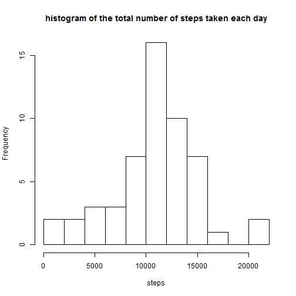
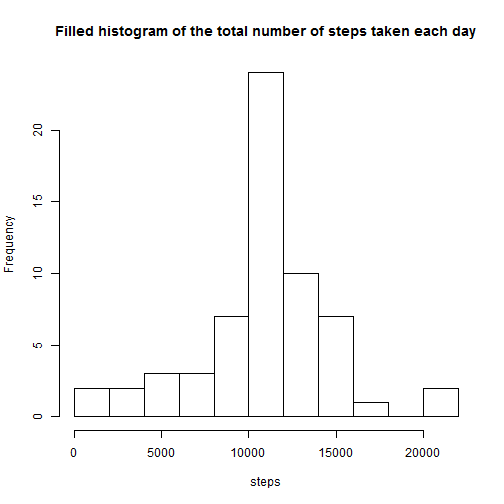

# Reproducible Research: Peer Assessment 1

## Loading and preprocessing the data

* load the data


```r
activity <- read.csv("../activity.csv")
```


* Process/transform the data (if necessary) into a format suitable for your analysis

convert column date to date format

```r
activity$date <- as.Date(activity$date, "%Y-%m-%d")
```


 Aggregate steps per day

```r
stepsDays <- aggregate(steps ~ date, activity, sum, na.rm = TRUE)
```


## What is mean total number of steps taken per day?

* Make a histogram of the total number of steps taken each day

```r
hist(stepsDays$steps, breaks = 8, xlab = "steps", main = "histogram of the total number of steps taken each day")
```

 


* Calculate and report the mean and median total number of steps taken per day

```r
mean(stepsDays$steps)
```

```
## [1] 10766
```

```r
median(stepsDays$steps)
```

```
## [1] 10765
```


mean total number of steps taken per day: 10766   
median total number of steps taken per day: 10765    

## What is the average daily activity pattern?

* Make a time series plot (i.e. type = "l") of the 5-minute interval (x-axis) and the average number of steps taken, averaged across all days (y-axis)  

```r
avgSteps <- aggregate(steps ~ interval, activity, na.rm = TRUE, mean)
with(avgSteps, plot(interval, steps, type = "l"))
```

 

* Which 5-minute interval, on average across all the days in the dataset, contains the maximum number of steps?


```r
avgSteps[which.max(avgSteps$steps), ]
```

```
##     interval steps
## 104      835 206.2
```


interal 835 contains the maximum numbers of steps which is 206.2

## Imputing missing values

* Calculate and report the total number of missing values in the dataset (i.e. the total number of rows with NAs)


```r
sum(is.na(activity))
```

```
## [1] 2304
```


the total number of rows with NAs is: 2304  

* Devise a strategy for filling in all of the missing values in the dataset. The strategy does not need to be sophisticated. For example, you could use the mean/median for that day, or the mean for that 5-minute interval, etc

As a strategie for filling,We're going replace NA with mean of that 5 minutes interval across all days

* Create a new dataset that is equal to the original dataset but with the missing data filled in.


```r
activityFilled <- activity
for (i in 1:length(activityFilled$interval)) {
    if (is.na(activityFilled$steps[i])) {
        the_steps <- avgSteps[avgSteps$interval == activityFilled$interv[i], 
            ]$steps
        activityFilled$steps[i] <- the_steps
    }
}
```

* Make a histogram of the total number of steps taken each day and Calculate and report the mean and median total number of steps taken per day. Do these values differ from the estimates from the first part of the assignment? What is the impact of imputing missing data on the estimates of the total daily number of steps?


```r
stepsDaysFilled <- aggregate(steps ~ date, activityFilled, sum)
hist(stepsDaysFilled$steps, breaks = 8, xlab = "steps", main = "Filled histogram of the total number of steps taken each day")
```

 

```r

mean(stepsDaysFilled$steps)
```

```
## [1] 10766
```

```r
median(stepsDaysFilled$steps)
```

```
## [1] 10766
```


mean of total number of steps taken per day: 10766  
median of total number of steps taken per day: 10766  

the impact of imputing missing data on the estimates of the total daily number of steps is almost insignificant.  

the values of mean and median are almost the same.  
histogram shows the same skewness with the same mean.   
But Frequency is higher with the last histogram .


## Are there differences in activity patterns between weekdays and weekends?

* Create a new factor variable in the dataset with two levels - "weekday" and "weekend" indicating whether a given date is a weekday or weekend day.


```r
Sys.setlocale("LC_TIME", "English")
```

```
## [1] "English_United States.1252"
```

```r
for (i in 1:nrow(activityFilled)) {
    if (weekdays(activityFilled$date[i]) %in% c("Saturday", "Sunday")) {
        activityFilled$weektype[i] <- "weekend"
    } else {
        activityFilled$weektype[i] <- "weekday"
    }
}

activityFilled$weektype <- as.factor(activityFilled$weektype)
```


* Make a panel plot containing a time series plot (i.e. type = "l") of the 5-minute interval (x-axis) and the average number of steps taken, averaged across all weekday days or weekend days (y-axis).


```r
avgStepsType <- aggregate(activityFilled$steps, by = list(activityFilled$interval, 
    activityFilled$weektype), mean)
colnames(avgStepsType) = c("interval", "weektype", "steps")
library(lattice)
xyplot(steps ~ interval | weektype, data = avgStepsType, type = "l", ylab = "Number of steps", 
    layout = c(1, 2))
```

 


the activity pattern between weekdays and weekends are differnt. On weekends,it's higher before 1000 interval and reach its peak 200 steps about 835 interval. Afterwards,The average is lower than weekdays (under 100 steps).
